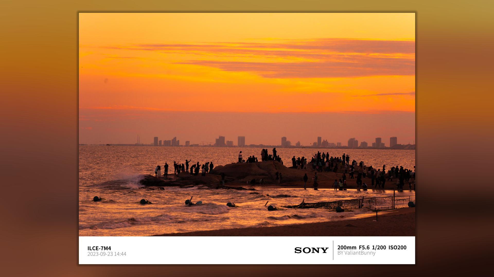

# camera_watermark

## 参数说明
```shell
usage: main.py [-h] [-f FILE] [-a AUTHOR] [-i INTPUT_DIR] [-o OUTPUT_DIR] [-d DRAW_TYPE]

optional arguments:
  -h, --help            show this help message and exit
  -f FILE, --file FILE  image file
  -a AUTHOR, --author AUTHOR
                        image author
  -i INTPUT_DIR, --intput_dir INTPUT_DIR
                        image input file
  -o OUTPUT_DIR, --output_dir OUTPUT_DIR
                        image output file
  -d DRAW_TYPE, --draw_type DRAW_TYPE
                        draw_type ['bottom', 'bottom_frame', 'video_use']

```

## 相机水印添加器
#### 添加底部水印


#### 添加框和底部水印


#### 视频用高斯模糊背景8K


#### 视频用高斯模糊背景8K 示例2

